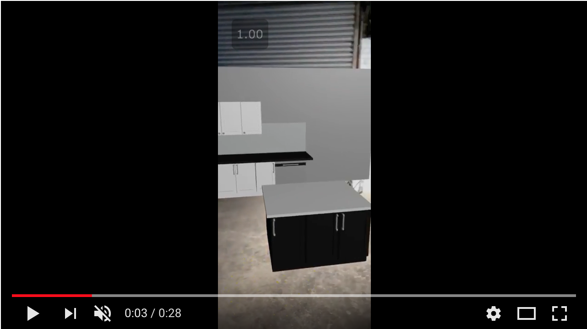

# Autodesk Forge AR - WebXR polyfill 

This was a sample exploration using Autodesk Forge and WebXR, we wanted to find a cheaper solution to view AR without of a headset.

We used Autodesk Forge for the translation of Revit files to OBJ in order to load it into the Scene of the WebRX. 

It needs the XRViewer from Mozilla [Link](https://itunes.apple.com/us/app/webxr-viewer/id1295998056?mt=8)

And you can head over to this url from the App referenced above.
[Demo](https://jaimerosales.github.io/webxr-polyfill/)

Here are some Videos on how it works.

We started with an empty wall where we wanted to place our AR Kitchen.

## Pre AR

## After AR

## Screen Recording AR - Click to Watch

# License

This sample is licensed under the terms of the [MIT License](http://opensource.org/licenses/MIT).
Please see the [LICENSE](LICENSE) file for full details.

## Written by

Jaime Rosales D.   
 

Michael Beale   
 

Forge Partner Development  
<a href="http://developer.autodesk.com/">Forge Developer Portal</a>  

